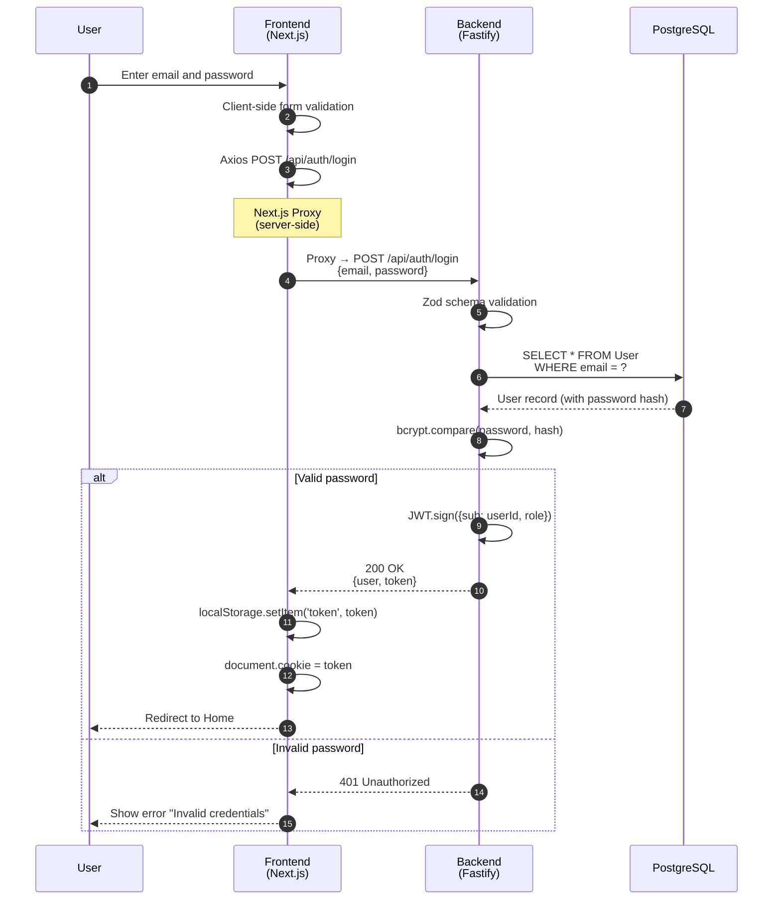
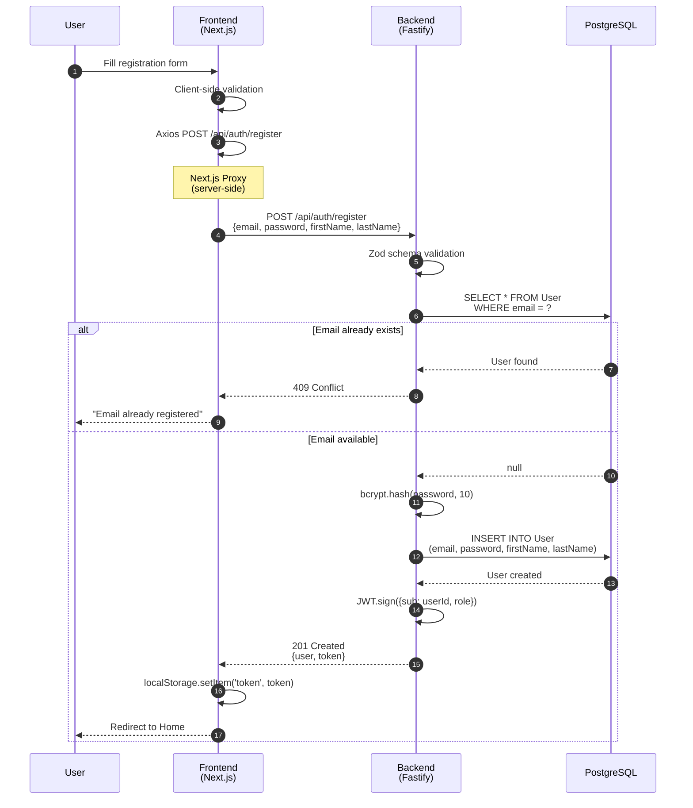
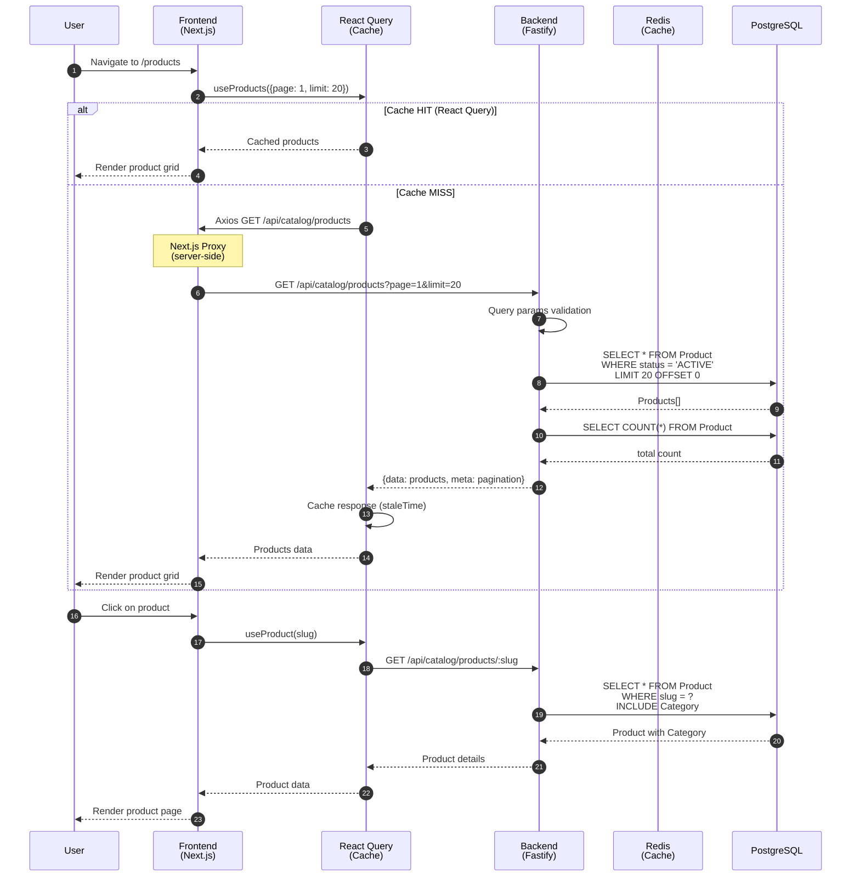
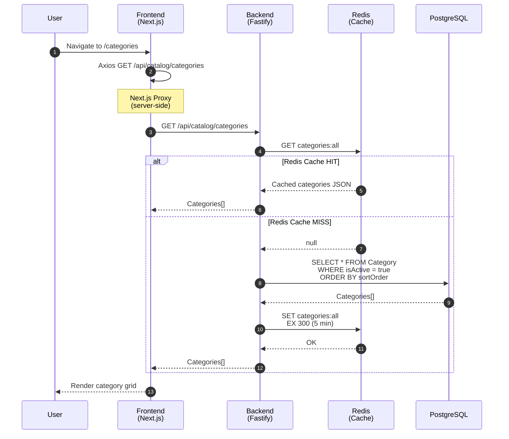
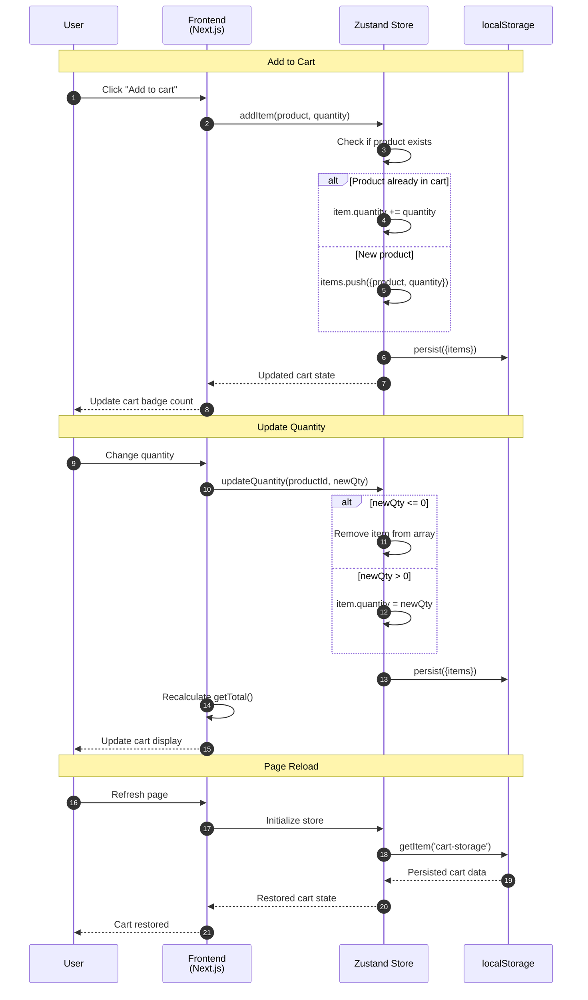
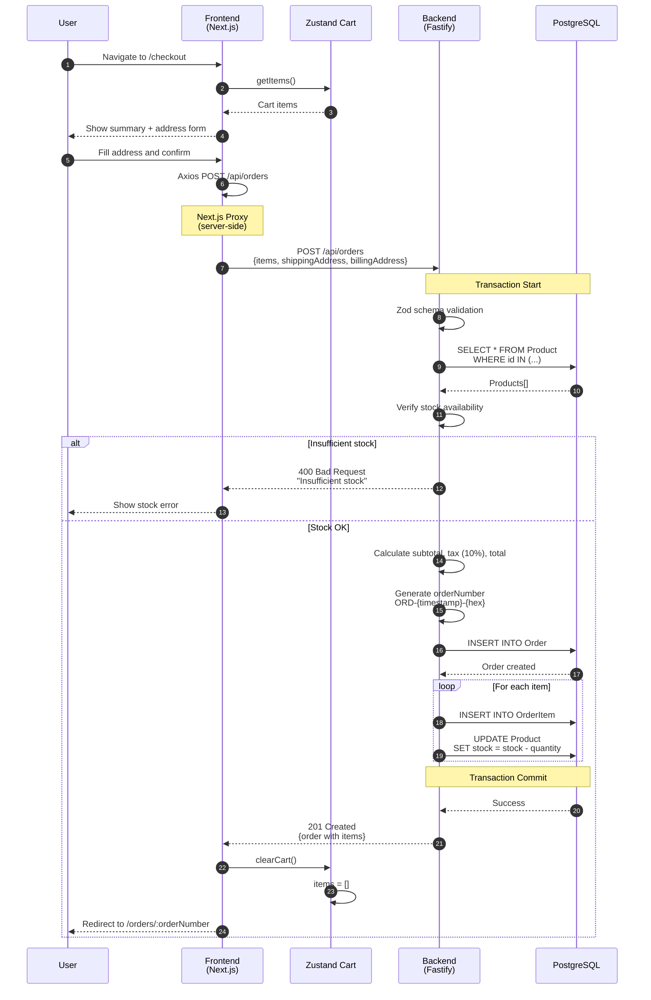
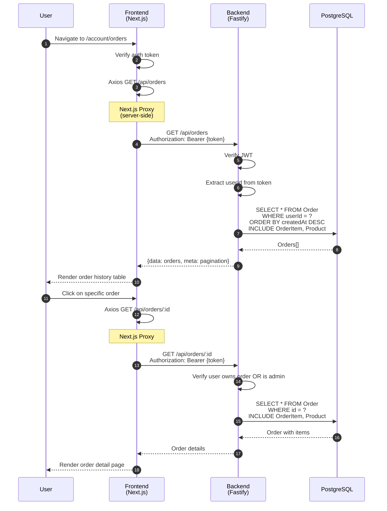
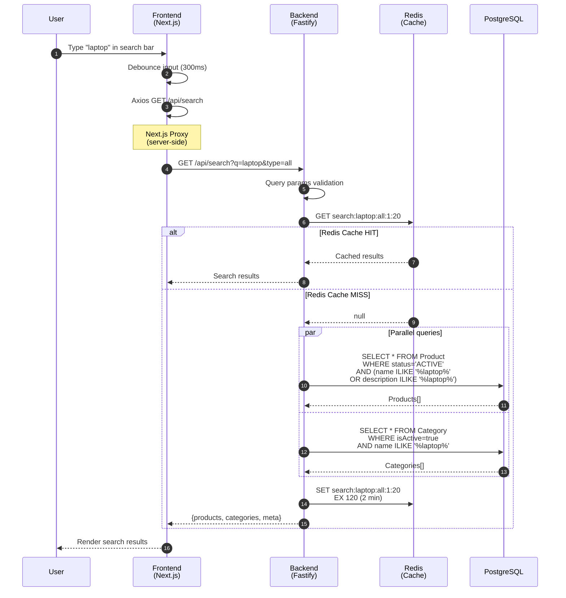
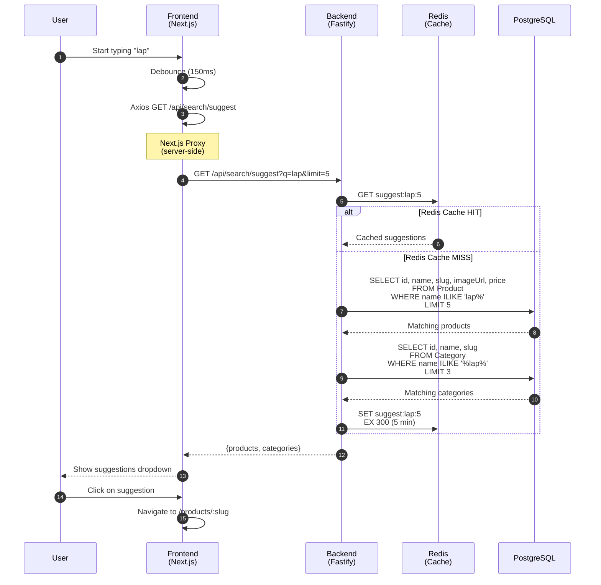
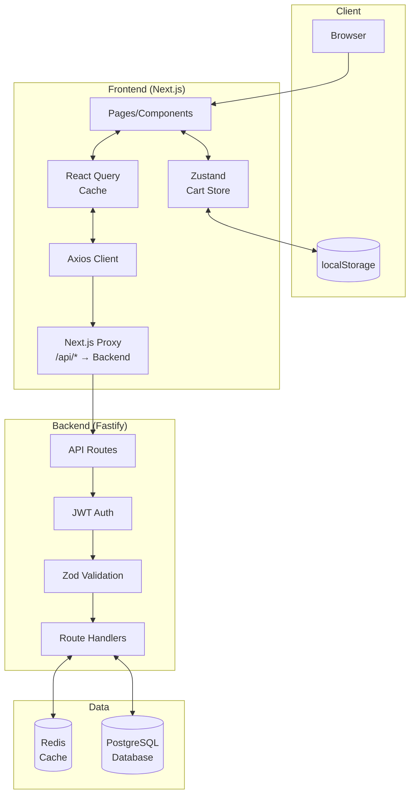

Sequence diagrams for the main application flows.

---

## 1. Authentication (Login)

---

## 2. Registration

---

## 3. Browse Products (with Cache)

---

## 4. Browse Categories (with Redis Cache)

---

## 5. Cart Management (Client-Side)

---

## 6. Checkout and Order Creation

---

## 7. View Orders

---

## 8. Product Search (with Redis Cache)

---

## 9. Autocomplete/Suggestions

---

## 10. General Architecture

> **Note:** All API calls from the browser go through Next.js which acts as a proxy to the backend.
> This avoids CORS issues and maintains a single domain for the user.

---

## Legend

| Component | Technology | Function |
|-----------|------------|----------|
| **Frontend** | Next.js 16 | UI, routing, state management |
| **React Query** | TanStack Query | Data fetching, client-side cache |
| **Zustand** | Zustand + persist | Cart state, localStorage sync |
| **Backend** | Fastify | REST API, business logic |
| **Redis** | Redis | Server-side cache (5-10 min TTL) |
| **PostgreSQL** | Prisma ORM | Persistent data storage |

---

## Cache Strategy

| Data | Cache Layer | TTL |
|------|-------------|-----|
| Categories | Redis | 5 min |
| Products list | React Query | staleTime |
| Search results | Redis | 2 min |
| Suggestions | Redis | 5 min |
| Popular items | Redis | 10 min |
| Cart | localStorage | Persistent |
| Auth token | localStorage | Until logout |

---

*Document generated: 2025-12-30*
