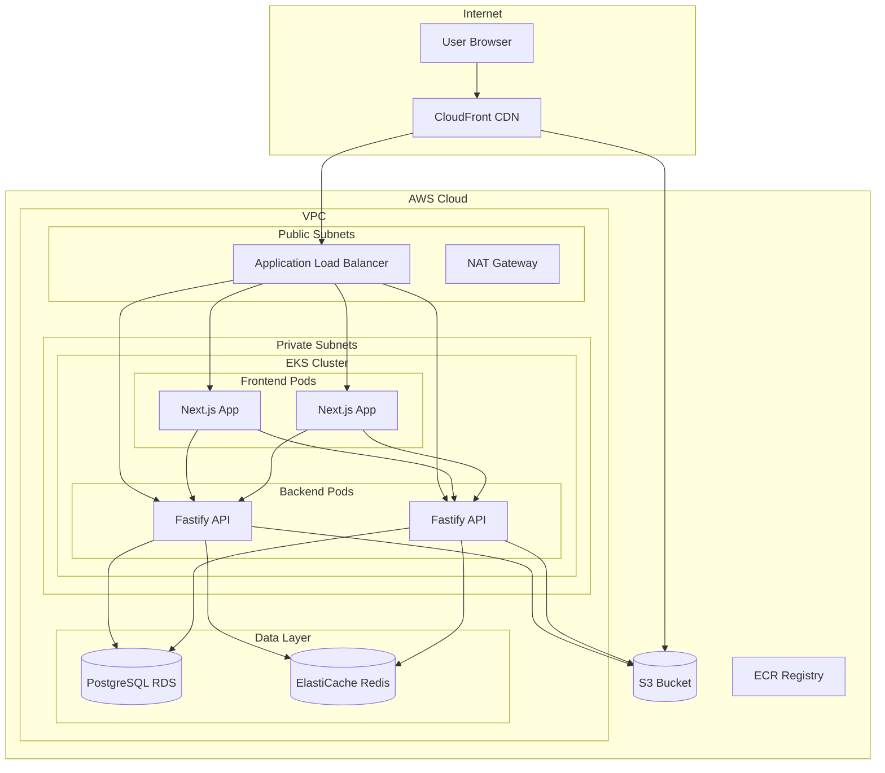

# E-commerce Demo

A production-ready e-commerce monorepo designed for deployment on AWS EKS. This project demonstrates modern cloud-native architecture patterns with a Next.js frontend and Fastify backend.

## Architecture Overview



## Tech Stack

### Frontend
- **Framework:** Next.js 16 (App Router)
- **Language:** TypeScript
- **Styling:** Tailwind CSS
- **State Management:** React Query (TanStack Query)
- **HTTP Client:** Axios

### Backend
- **Runtime:** Node.js 20
- **Framework:** Fastify
- **Language:** TypeScript
- **ORM:** Prisma
- **Validation:** Zod
- **Authentication:** JWT (jsonwebtoken)
- **Logging:** Pino
- **Cache:** Redis (ioredis)

### Infrastructure
- **Cloud:** AWS
- **Container Orchestration:** EKS (Kubernetes)
- **IaC:** Terraform
- **Package Management:** Helm
- **CI/CD:** GitHub Actions
- **Database:** PostgreSQL (RDS)
- **Cache:** Redis (ElastiCache)
- **CDN:** CloudFront
- **Storage:** S3

## Project Structure

```
ecommerce-demo/
├── apps/
│   ├── frontend/          # Next.js frontend application
│   └── backend/           # Fastify backend API
├── infra/
│   └── terraform/         # Terraform IaC modules
├── helm/                  # Helm charts for K8s deployment
├── .github/workflows/     # CI/CD pipelines
├── scripts/               # Utility scripts
└── docs/                  # Documentation
```

## Quick Start

### Prerequisites

- Docker & Docker Compose (required)
- Node.js 20+ (only for development mode)
- AWS CLI, kubectl, Terraform, Helm (only for deployment)

### Option 1: Full Docker (Recommended)

The easiest way to run the complete application:

```bash
# Clone and start
git clone <repository-url>
cd ecommerce-demo
docker-compose -f docker-compose.full.yml up --build
```

**That's it!** The application will be available at:
- Frontend: http://localhost:3000
- Backend API: http://localhost:4000
- Adminer (DB UI): http://localhost:8080

**Demo Users:**
| Email | Password | Role |
|-------|----------|------|
| admin@example.com | password123 | Admin |
| john@example.com | password123 | User |
| jane@example.com | password123 | User |

```bash
# Stop services
docker-compose -f docker-compose.full.yml down

# Reset everything (including data)
docker-compose -f docker-compose.full.yml down -v
```

### Option 2: Development Mode (Hot Reload)

For active development with hot reload:

```bash
# Clone the repository
git clone <repository-url>
cd ecommerce-demo

# Start database services
docker-compose up -d

# Install dependencies
npm install

# Setup database
npm run db:generate -w apps/backend
npm run db:push -w apps/backend
npm run db:seed -w apps/backend

# Start development servers
npm run dev
```

- Frontend: http://localhost:3000
- Backend: http://localhost:4000
- Adminer (DB UI): http://localhost:8080

### Available Scripts

| Command | Description |
|---------|-------------|
| `npm run dev` | Start all apps in development mode |
| `npm run build` | Build all apps for production |
| `npm run test` | Run tests across all apps |
| `npm run lint` | Lint all apps |
| `npm run docker:up` | Start Docker services (PostgreSQL, Redis) |
| `npm run docker:down` | Stop Docker services |
| `npm run db:migrate` | Run Prisma migrations |
| `npm run db:seed` | Seed the database |
| `npm run db:studio` | Open Prisma Studio |

## Documentation

- [Setup Guide](docs/SETUP.md) - Detailed setup instructions
- [Development Guide](docs/DEVELOPMENT.md) - Development workflow and conventions
- [Deployment Guide](docs/DEPLOYMENT.md) - AWS deployment instructions
- [API Documentation](docs/API.md) - Backend API reference

## Environment Variables

See `.env.example` files in each app directory for required environment variables.

## Contributing

1. Create a feature branch from `main`
2. Make your changes
3. Run tests and linting
4. Submit a pull request

## License

MIT License - see LICENSE file for details.
