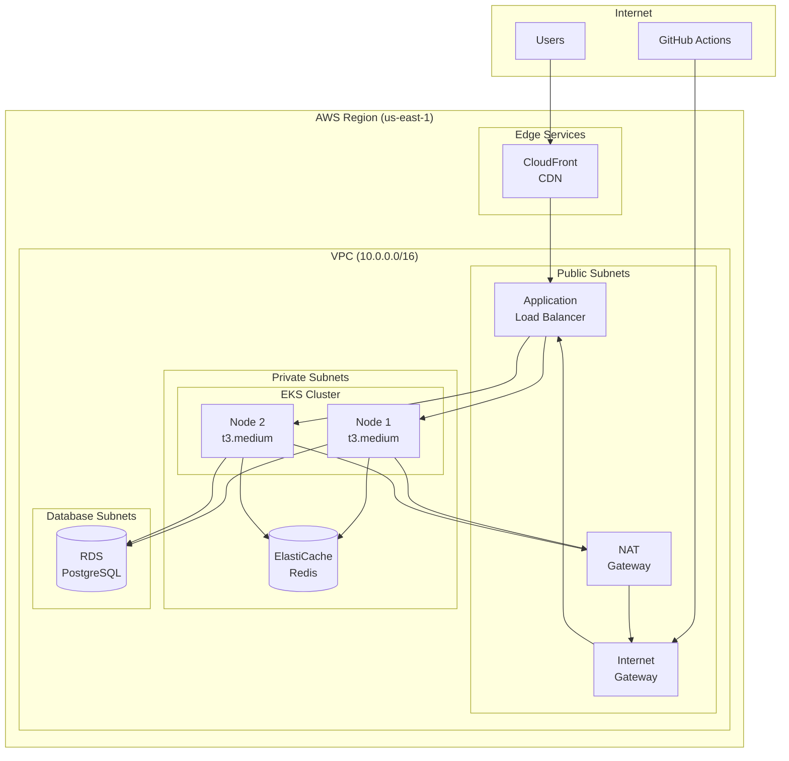
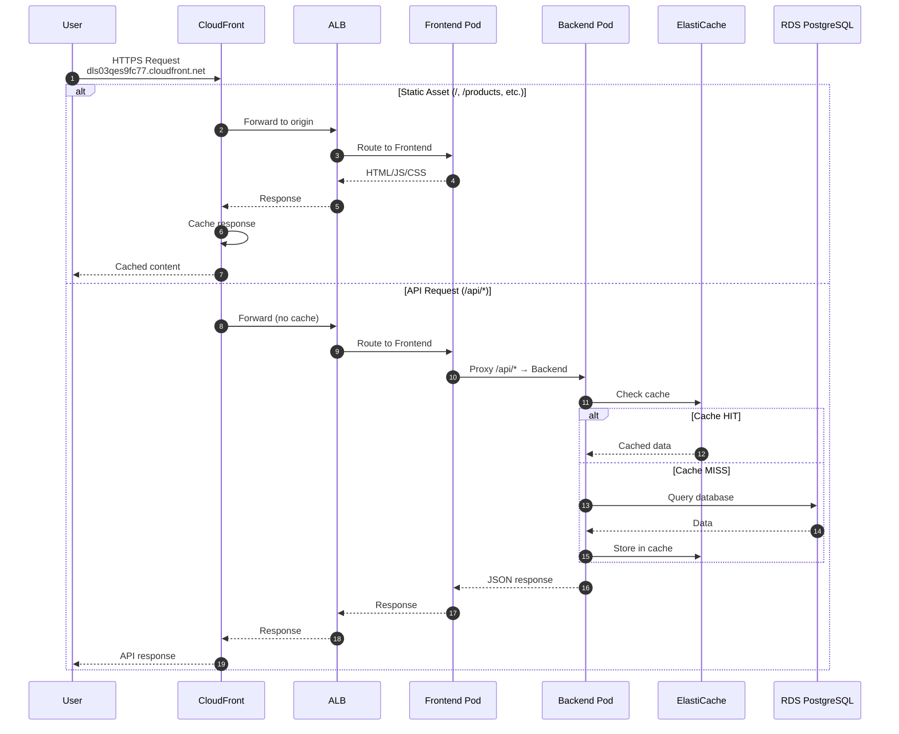
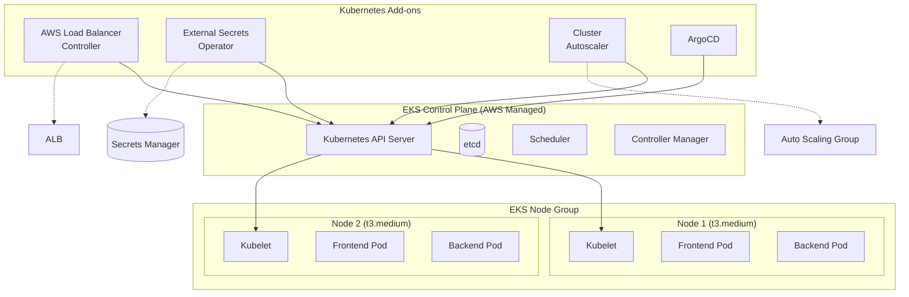
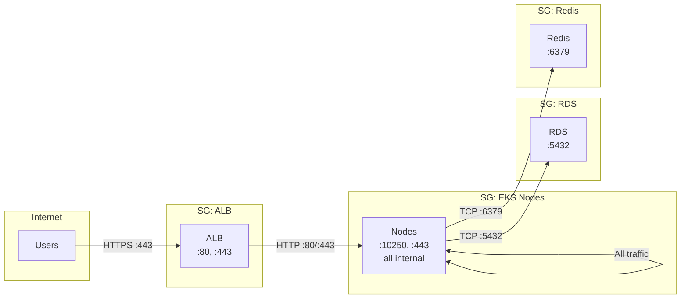
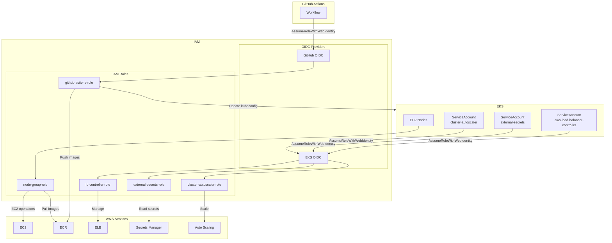
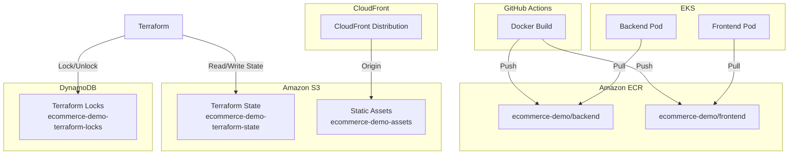
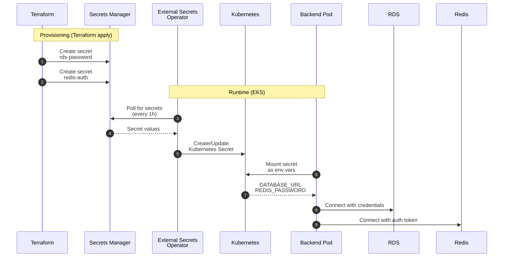
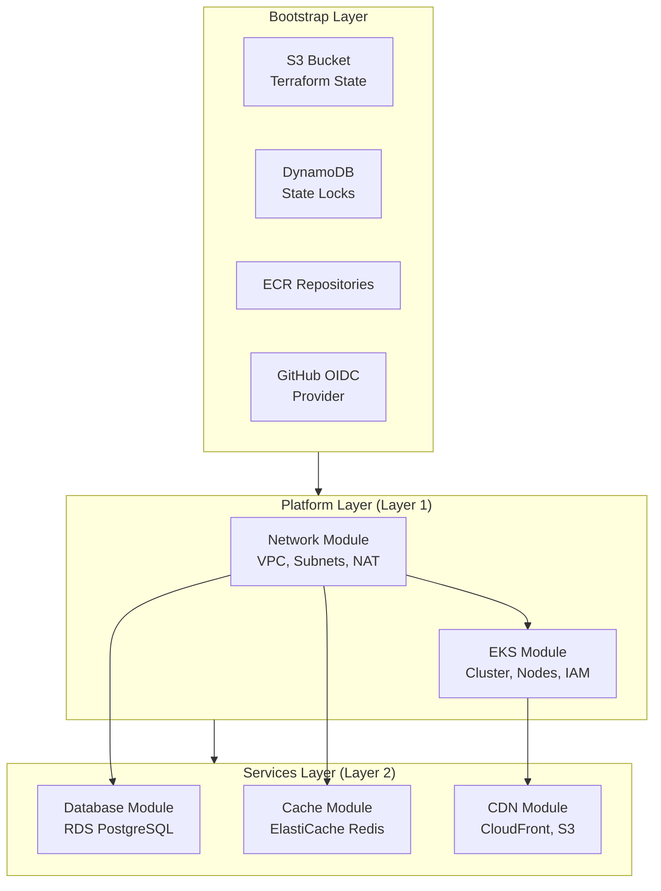
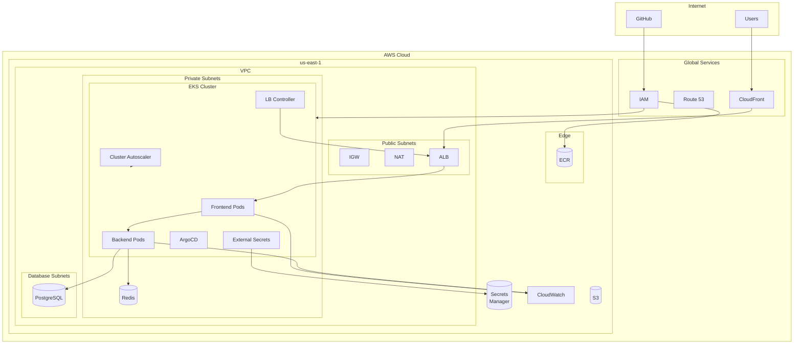

# AWS Architecture - E-commerce Demo

Diagrams of AWS architecture and service interactions.

---

## AWS Services Overview

| Category | Service | Purpose |
|----------|---------|---------|
| **Compute** | EKS | Kubernetes cluster |
| **Compute** | EC2 (Node Group) | Worker nodes |
| **Network** | VPC | Isolated network |
| **Network** | ALB | Application load balancer |
| **Network** | NAT Gateway | Internet access for private subnets |
| **Network** | CloudFront | Global CDN |
| **Database** | RDS PostgreSQL | Relational database |
| **Cache** | ElastiCache Redis | In-memory cache |
| **Storage** | S3 | Static assets + Terraform state |
| **Storage** | ECR | Container registry |
| **Security** | Secrets Manager | Database/cache credentials |
| **Security** | IAM | Roles and policies |
| **Monitoring** | CloudWatch | Logs and metrics |

---

## 1. Network Architecture

---

## 2. User Traffic Flow

---

## 3. EKS Architecture

---

## 4. Security Groups and Network Flow

---

## 5. IAM Roles and IRSA

---

## 6. Storage and Registry

---

## 7. Secrets Management

---

## 8. Terraform Layer Architecture

---

## 9. Estimated Costs (Demo Environment)

| Service | Configuration | Cost/month (USD) |
|---------|---------------|------------------|
| **EKS Control Plane** | 1 cluster | $73 |
| **EC2 (Nodes)** | 2× t3.medium | ~$60 |
| **RDS PostgreSQL** | db.t3.micro | ~$15 |
| **ElastiCache Redis** | cache.t3.micro | ~$12 |
| **NAT Gateway** | 1 gateway | ~$32 |
| **CloudFront** | Pay per use | ~$1-5 |
| **ALB** | 1 load balancer | ~$16 |
| **S3** | < 1 GB | < $1 |
| **ECR** | < 1 GB | < $1 |
| **Secrets Manager** | 2 secrets | < $1 |
| **CloudWatch** | Basic | ~$3 |
| **Data Transfer** | Variable | ~$5-10 |
| **TOTAL** | | **~$220-230/month** |

> **Note:** Costs based on us-east-1, demo environment with minimal resources.
> Production costs increase significantly (Multi-AZ RDS, larger nodes, etc.)

---

## 10. Complete Architecture

---

## References

| Resource | Value |
|----------|-------|
| **VPC CIDR** | 10.0.0.0/16 |
| **Region** | us-east-1 |
| **AZs** | us-east-1a, us-east-1b |
| **EKS Version** | 1.32 |
| **Node AMI** | Amazon Linux 2023 |
| **RDS Engine** | PostgreSQL 15 |
| **Redis Engine** | Redis 7 |

---

*Document generated: 2025-12-31*
