# Enterprise Architecture - E-commerce Demo

High-level enterprise architecture integrating application, CI/CD, and AWS infrastructure.

---

## 1. Complete Overview (C4 - Context Level)

```mermaid
flowchart TB
    subgraph Actors["Actors"]
        User[("👤 User")]
        Dev[("👨‍💻 Developer")]
        Ops[("🔧 Ops/SRE")]
    end

    subgraph ExternalSystems["External Systems"]
        GitHub[("GitHub<br/>Repository + Actions")]
    end

    subgraph System["E-commerce Platform"]
        direction TB
        App["🛒 E-commerce Application<br/>Next.js + Fastify"]
    end

    subgraph Cloud["AWS Cloud"]
        Infra["☁️ Cloud Infrastructure<br/>EKS + RDS + Redis + CDN"]
    end

    User -->|"Browse, Search, Order"| App
    Dev -->|"Code, PR, Review"| GitHub
    Ops -->|"Monitor, Scale, Deploy"| Infra
    GitHub -->|"CI/CD Pipeline"| Infra
    App -->|"Runs on"| Infra
```

---

## 2. Container View (C4 - Container Level)

```mermaid
flowchart TB
    subgraph Users["Users"]
        Browser["🌐 Browser"]
        Mobile["📱 Mobile"]
    end

    subgraph CDN["Content Delivery"]
        CloudFront["CloudFront<br/>HTTPS Termination<br/>Edge Caching"]
    end

    subgraph LoadBalancer["Load Balancing"]
        ALB["ALB<br/>L7 Load Balancer<br/>Path-based Routing"]
    end

    subgraph Application["Application Layer (EKS)"]
        FE["Frontend<br/>━━━━━━━━━━<br/>Next.js 16<br/>React Query<br/>Zustand"]
        BE["Backend<br/>━━━━━━━━━━<br/>Fastify<br/>Prisma ORM<br/>JWT Auth"]
    end

    subgraph Data["Data Layer"]
        Redis[("Redis<br/>━━━━━━━━━━<br/>Session Cache<br/>Query Cache<br/>Rate Limit")]
        PostgreSQL[("PostgreSQL<br/>━━━━━━━━━━<br/>Users<br/>Products<br/>Orders")]
    end

    subgraph Storage["Storage"]
        S3[("S3<br/>Static Assets")]
    end

    Browser --> CloudFront
    Mobile --> CloudFront
    CloudFront --> ALB
    CloudFront --> S3
    ALB --> FE
    FE -->|"Proxy /api/*"| BE
    BE --> Redis
    BE --> PostgreSQL
```

---

## 3. End-to-End DevOps Pipeline

```mermaid
flowchart LR
    subgraph Development["Development"]
        Code["📝 Code"]
        PR["Pull Request"]
    end

    subgraph CI["Continuous Integration"]
        Security["🔒 Security<br/>Gitleaks<br/>Checkov<br/>Trivy"]
        Quality["✅ Quality<br/>Lint<br/>Test<br/>Type Check"]
        Build["📦 Build<br/>Docker<br/>Push ECR"]
    end

    subgraph CD["Continuous Deployment"]
        ArgoCD["🔄 ArgoCD<br/>GitOps Sync"]
        K8s["☸️ Kubernetes<br/>Rolling Update"]
    end

    subgraph Operate["Operate"]
        Monitor["📊 Monitor<br/>CloudWatch<br/>Logs"]
        Scale["⚖️ Scale<br/>HPA<br/>Cluster Autoscaler"]
    end

    Code --> PR
    PR --> Security
    Security --> Quality
    Quality --> Build
    Build --> ArgoCD
    ArgoCD --> K8s
    K8s --> Monitor
    Monitor --> Scale
    Scale -.->|"Feedback"| Code
```

---

## 4. Layered Architecture

```mermaid
flowchart TB
    subgraph Presentation["🖥️ PRESENTATION LAYER"]
        direction LR
        CF["CloudFront CDN"]
        UI["Next.js SSR/CSR"]
    end

    subgraph Application["⚙️ APPLICATION LAYER"]
        direction LR
        API["Fastify REST API"]
        Auth["JWT Authentication"]
        Valid["Zod Validation"]
    end

    subgraph Business["💼 BUSINESS LAYER"]
        direction LR
        Catalog["Catalog Service"]
        Orders["Orders Service"]
        Search["Search Service"]
        AuthSvc["Auth Service"]
    end

    subgraph Integration["🔌 INTEGRATION LAYER"]
        direction LR
        Prisma["Prisma ORM"]
        RedisClient["Redis Client"]
        SecretsSDK["AWS Secrets SDK"]
    end

    subgraph Data["💾 DATA LAYER"]
        direction LR
        PG[("PostgreSQL")]
        RedisDB[("Redis")]
        SM[("Secrets Manager")]
    end

    Presentation --> Application
    Application --> Business
    Business --> Integration
    Integration --> Data
```

---

## 5. Complete Data Flow

```mermaid
sequenceDiagram
    autonumber
    box rgb(240,248,255) Client
        participant User as 👤 User
        participant Browser as 🌐 Browser
    end

    box rgb(255,250,240) Edge
        participant CF as CloudFront
        participant ALB as ALB
    end

    box rgb(240,255,240) Application
        participant FE as Frontend
        participant BE as Backend
    end

    box rgb(255,240,245) Data
        participant Cache as Redis
        participant DB as PostgreSQL
    end

    User->>Browser: Navigate to /products
    Browser->>CF: GET /products
    CF->>ALB: Forward request
    ALB->>FE: Route to Frontend pod

    FE->>FE: Server-side render
    FE->>BE: GET /api/catalog/products

    BE->>Cache: Check cache
    alt Cache HIT
        Cache-->>BE: Cached products
    else Cache MISS
        BE->>DB: SELECT * FROM products
        DB-->>BE: Product data
        BE->>Cache: SET (TTL: 5min)
    end

    BE-->>FE: JSON response
    FE-->>ALB: HTML + hydration data
    ALB-->>CF: Response
    CF->>CF: Cache at edge
    CF-->>Browser: Rendered page
    Browser-->>User: Display products
```

---

## 6. Security Architecture

---

## 7. Infrastructure as Code

```mermaid
flowchart TB
    subgraph IaC["Infrastructure as Code"]
        subgraph Terraform["Terraform"]
            Bootstrap["Bootstrap<br/>━━━━━━━━━━<br/>S3 State<br/>DynamoDB Locks<br/>ECR<br/>GitHub OIDC"]
            Platform["Platform<br/>━━━━━━━━━━<br/>VPC<br/>EKS<br/>Security Groups"]
            Services["Services<br/>━━━━━━━━━━<br/>RDS<br/>ElastiCache<br/>CloudFront"]
        end

        subgraph Helm["Helm Charts"]
            FE_Chart["Frontend Chart<br/>━━━━━━━━━━<br/>Deployment<br/>Service<br/>Ingress<br/>HPA"]
            BE_Chart["Backend Chart<br/>━━━━━━━━━━<br/>Deployment<br/>Service<br/>ExternalSecret<br/>HPA"]
        end

        subgraph K8s["Kubernetes Manifests"]
            ArgoCD_M["ArgoCD<br/>━━━━━━━━━━<br/>Project<br/>Applications"]
            Addons["Add-ons<br/>━━━━━━━━━━<br/>LB Controller<br/>External Secrets<br/>Cluster Autoscaler"]
        end
    end

    subgraph State["State Management"]
        S3[("S3<br/>terraform.tfstate")]
        Git[("Git<br/>Helm values<br/>K8s manifests")]
    end

    Bootstrap --> Platform
    Platform --> Services
    Terraform --> S3
    Helm --> Git
    K8s --> Git
```

---

## 8. Deployment Architecture

---

## 9. Scalability Architecture

```mermaid
flowchart TB
    subgraph Traffic["📈 Traffic Growth"]
        Low["Low Traffic"]
        Medium["Medium Traffic"]
        High["High Traffic"]
        Spike["Traffic Spike"]
    end

    subgraph Horizontal["↔️ Horizontal Scaling"]
        HPA["HPA<br/>━━━━━━━━━━<br/>CPU > 45%<br/>Min: 2, Max: 7"]
        CA["Cluster Autoscaler<br/>━━━━━━━━━━<br/>Node: 2-5<br/>t3.medium"]
    end

    subgraph Caching["💨 Caching Layers"]
        CF_Cache["CloudFront<br/>Edge Cache"]
        RQ_Cache["React Query<br/>Client Cache"]
        Redis_Cache["Redis<br/>Server Cache"]
    end

    subgraph Database["💾 Database Scaling"]
        RDS_Scale["RDS<br/>━━━━━━━━━━<br/>Vertical Scaling<br/>Read Replicas<br/>(if needed)"]
        Redis_Scale["ElastiCache<br/>━━━━━━━━━━<br/>Cluster Mode<br/>(if needed)"]
    end

    Low --> HPA
    Medium --> HPA
    High --> CA
    Spike --> CA

    HPA --> Caching
    CA --> Caching
    Caching --> Database
```

---

## 10. Monitoring & Observability

---

## 11. Cost Architecture

---

## 12. Technology Stack Summary

---

## 13. Architecture Summary

| Aspect | Choice | Rationale |
|--------|--------|-----------|
| **Frontend** | Next.js 16 SSR | SEO, Performance, Developer Experience |
| **Backend** | Fastify | Performance, TypeScript, Plugin ecosystem |
| **Database** | PostgreSQL | ACID, JSON support, Prisma compatibility |
| **Cache** | Redis | Speed, Data structures, Pub/Sub capability |
| **Container Orchestration** | EKS | AWS integration, Managed control plane |
| **CI/CD** | GitHub Actions + ArgoCD | GitOps, Declarative, Audit trail |
| **IaC** | Terraform | Multi-cloud, State management, Modules |
| **Secrets** | External Secrets Operator | Native K8s integration, AWS SM sync |
| **CDN** | CloudFront | Global edge, AWS integration |
| **Monitoring** | CloudWatch | Native AWS, No extra cost |

---

## 14. Related Diagrams

| Document | Content |
|----------|---------|
| [SEQUENCE_DIAGRAMS_eng.md](./SEQUENCE_DIAGRAMS_eng.md) | Detailed application flows |
| [GITHUB_PIPELINES_eng.md](./GITHUB_PIPELINES_eng.md) | CI/CD pipelines |
| [AWS_ARCHITECTURE_eng.md](./AWS_ARCHITECTURE_eng.md) | Detailed AWS infrastructure |
| [K8S_UPGRADE_eng.md](./K8S_UPGRADE_eng.md) | EKS 1.29 → 1.32 upgrade |
| [CVE_ANALYSIS_eng.md](./CVE_ANALYSIS_eng.md) | Vulnerability analysis |

---

*Document generated: 2025-12-31*
*Architecture: E-commerce Demo on AWS EKS*
