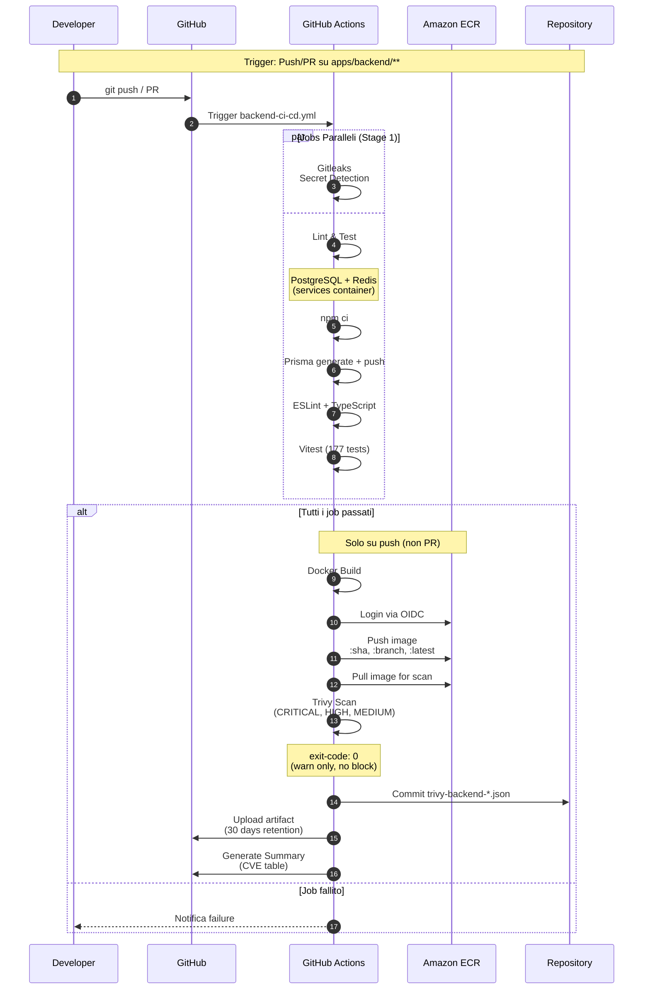
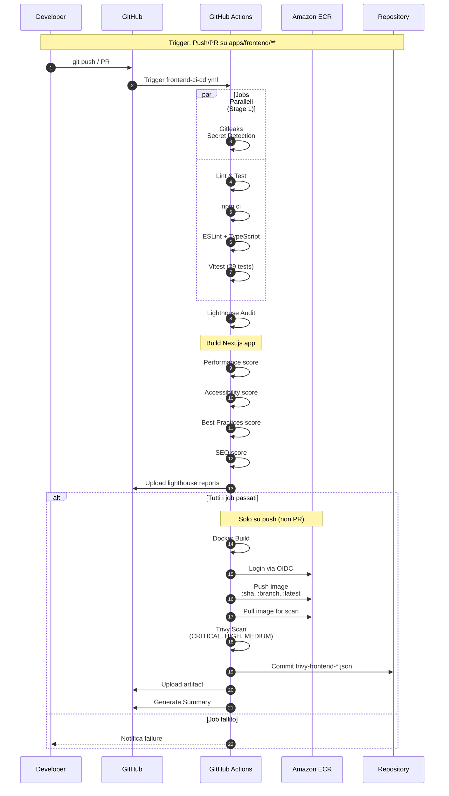
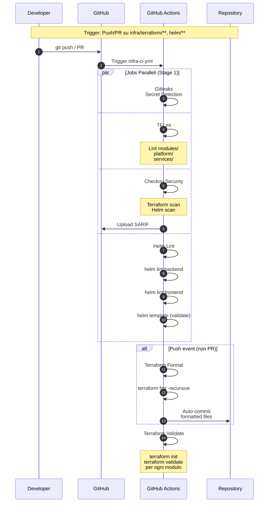
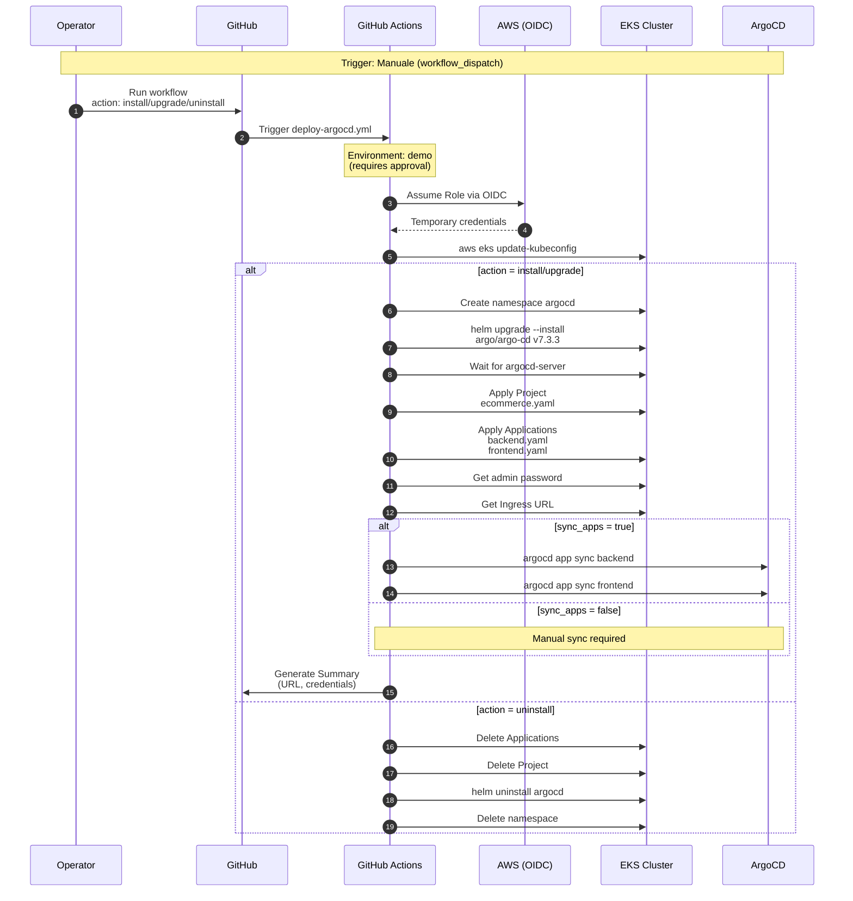
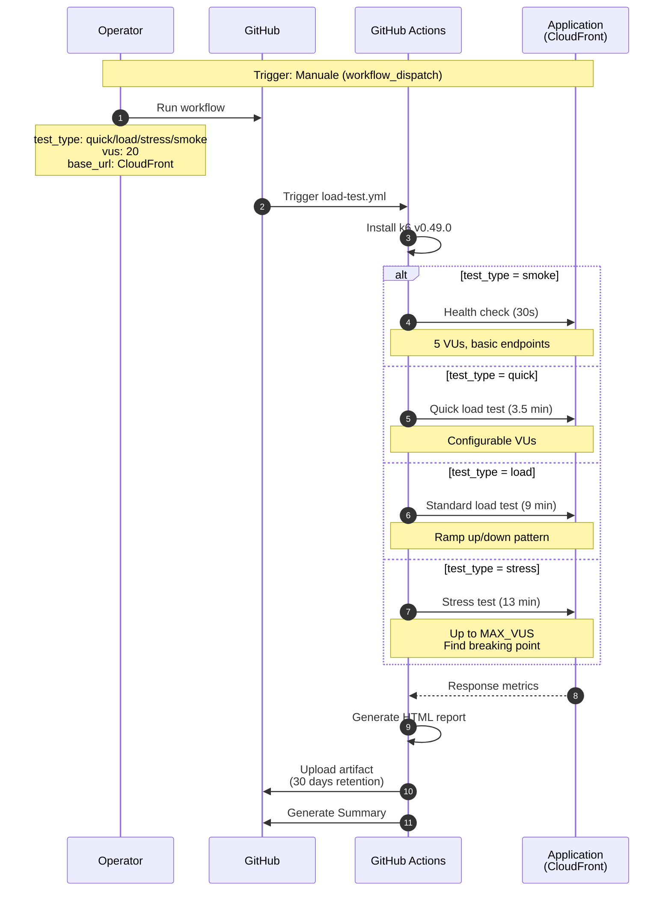
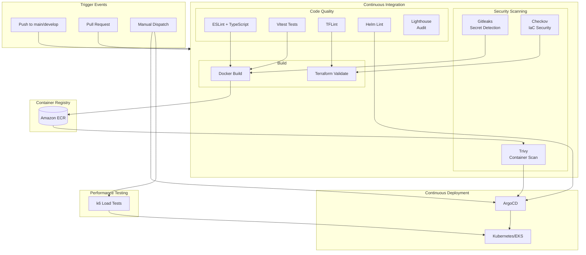

# GitHub Actions Pipelines - E-commerce Demo

Diagrammi delle pipeline CI/CD implementate nel progetto.

---

## Panoramica Workflows

| Workflow | Trigger | Scopo |
|----------|---------|-------|
| **Backend CI/CD** | Push/PR su `apps/backend/**` | Build, test, security scan |
| **Frontend CI/CD** | Push/PR su `apps/frontend/**` | Build, test, Lighthouse, security scan |
| **Infrastructure CI** | Push/PR su `infra/terraform/**`, `helm/**` | Lint, validate, security scan |
| **Deploy ArgoCD** | Manuale (workflow_dispatch) | Deploy ArgoCD + Applications |
| **Load Test** | Manuale (workflow_dispatch) | k6 performance testing |

---

## 1. Backend CI/CD Pipeline



---

## 2. Frontend CI/CD Pipeline



---

## 3. Infrastructure CI Pipeline



---

## 4. Deploy ArgoCD Workflow



---

## 5. Load Test Workflow



---

## 6. Architettura Completa CI/CD



---

## Job Dependencies

### Backend CI/CD
```
gitleaks ─────┐
              ├──> build ──> trivy-scan
lint-and-test ┘
```

### Frontend CI/CD
```
gitleaks ─────┐
              ├──> build ──> trivy-scan
lint-and-test ┘
      │
      └──> lighthouse
```

### Infrastructure CI
```
gitleaks ────┐
tflint ──────┤ (parallel)
checkov ─────┤
helm-lint ───┘
      │
terraform-fmt ──> terraform-validate
```

---

## Secrets e Variabili

| Nome | Tipo | Uso |
|------|------|-----|
| `AWS_ROLE_ARN` | Secret | OIDC role per AWS |
| `GITHUB_TOKEN` | Auto | Commit, artifacts |
| `NEXT_PUBLIC_API_URL` | Variable | Frontend build arg |

---

## Artifacts Prodotti

| Workflow | Artifact | Retention |
|----------|----------|-----------|
| Backend CI | `trivy-backend-report` | 30 giorni |
| Frontend CI | `trivy-frontend-report` | 30 giorni |
| Frontend CI | `lighthouse-reports` | 30 giorni |
| Load Test | `k6-reports-*` | 30 giorni |

---

## File di Configurazione

| File | Scopo |
|------|-------|
| `.checkov.yaml` | Skip rules per Checkov |
| `.tflint.hcl` | Plugin AWS per TFLint |
| `.gitleaks.toml` | Allowlist per Gitleaks |
| `lighthouserc.json` | Configurazione Lighthouse |

---

*Documento generato: 2025-12-31*
