# Observability Architecture - E-commerce Demo

Diagrams of the observability architecture: logs, traces, and metrics.

---

## Observability Stack Overview

| Category | Service | Purpose |
|----------|---------|---------|
| **Logs** | CloudWatch Logs | Container log aggregation |
| **Metrics** | Container Insights | Pod/node/cluster metrics |
| **Tracing** | AWS X-Ray | Distributed tracing |
| **Agent** | CloudWatch Agent | Container Insights metrics collection |
| **Daemon** | X-Ray Daemon | Trace collection and submission |
| **IAM** | IRSA | Service account authentication |

---

## 1. General Observability Architecture

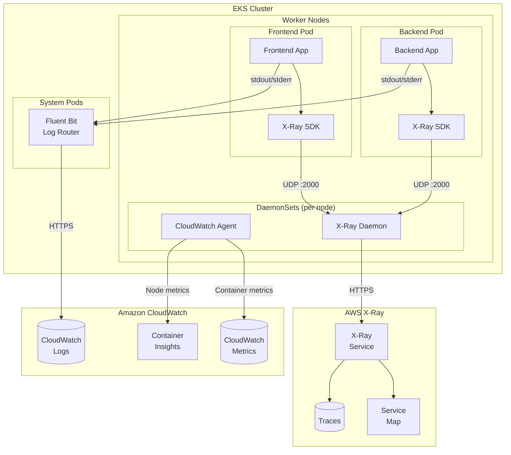

---

## 2. Log Collection Flow

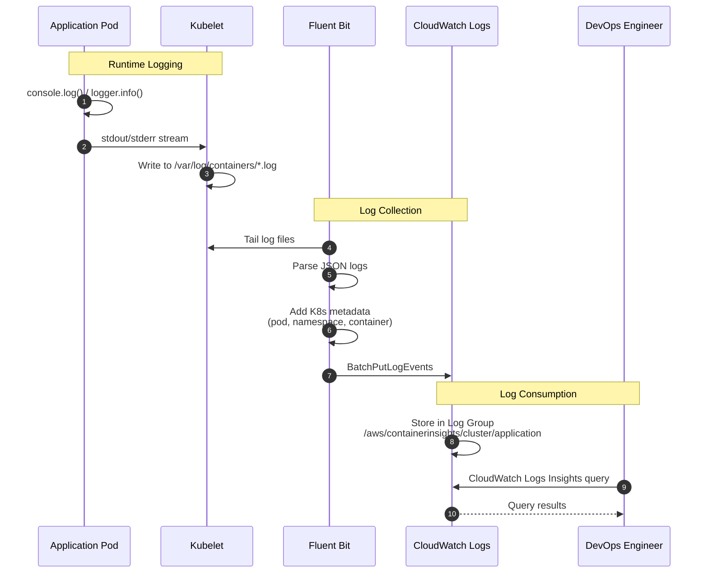

---

## 3. X-Ray Distributed Tracing Flow

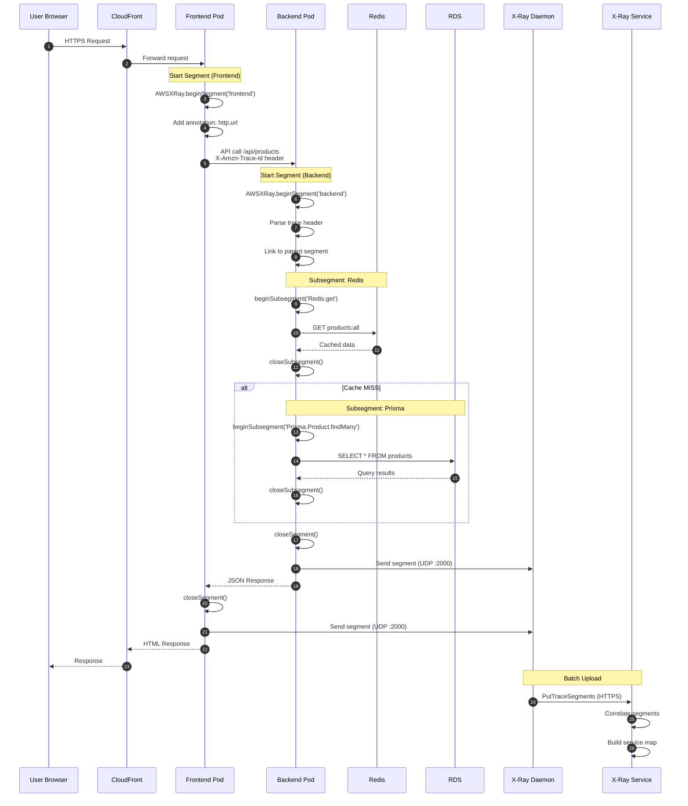

---

## 4. Container Insights - Metrics Flow

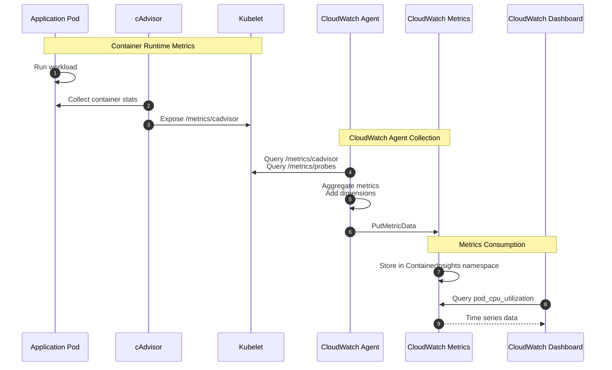

---

## 5. X-Ray DaemonSet Architecture

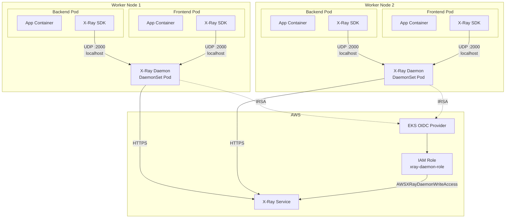

---

## 6. IAM Roles for Observability (IRSA)

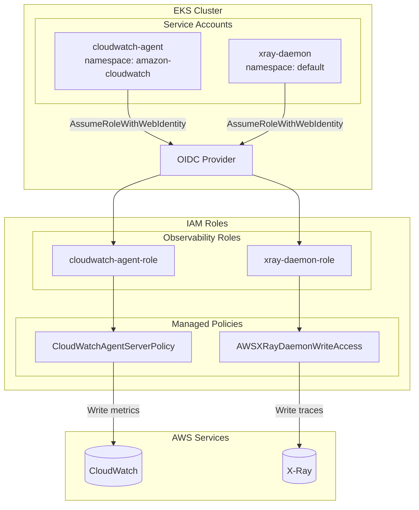

---

## 7. Log Groups Structure

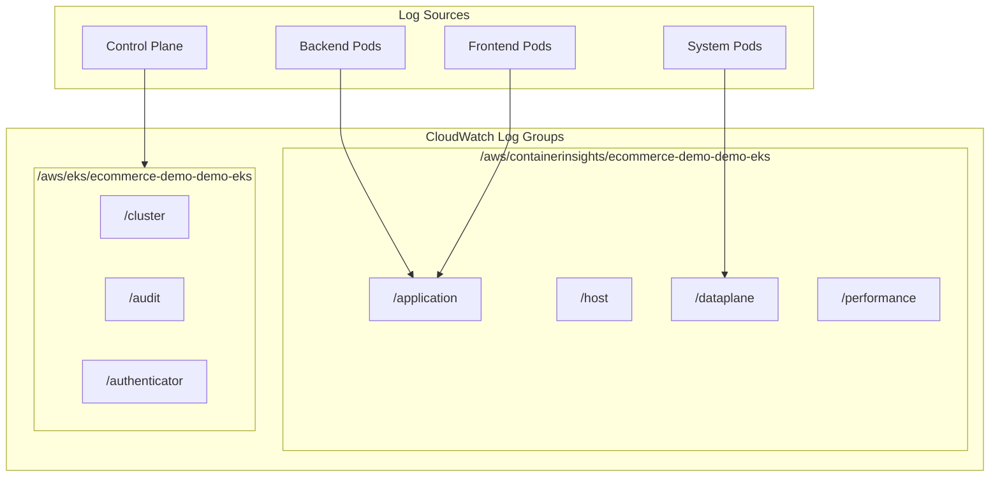

---

## 8. Container Insights Metrics

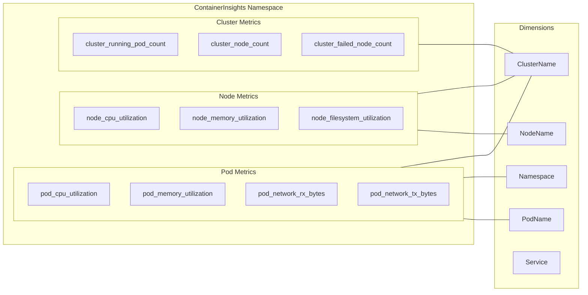

---

## 9. X-Ray Service Map

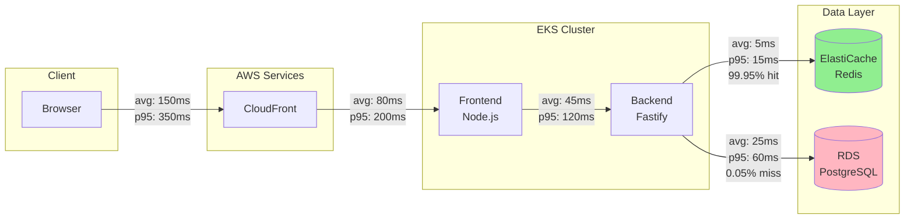

---

## 10. Complete Request Flow with Observability

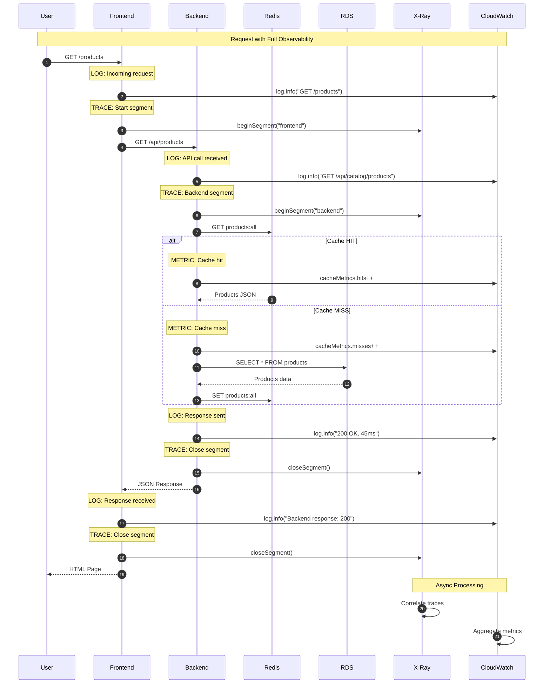

---

## 11. Alerting and Monitoring

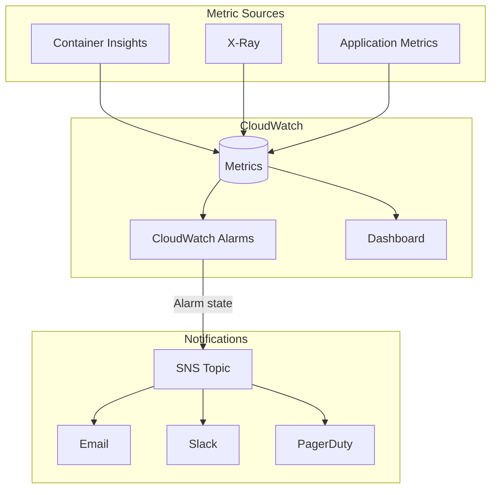

---

## 12. Complete Observability Architecture

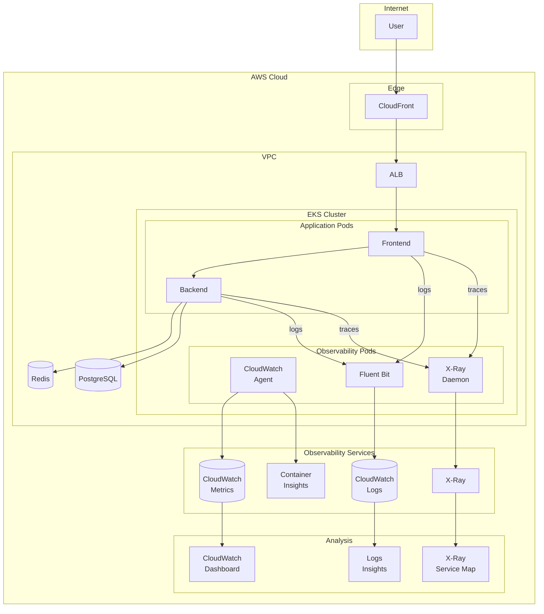

---

## Terraform Configuration

### Container Insights Add-on

```hcl
resource "aws_eks_addon" "cloudwatch_observability" {
  cluster_name  = aws_eks_cluster.main.name
  addon_name    = "amazon-cloudwatch-observability"
  addon_version = "v2.1.0-eksbuild.1"

  service_account_role_arn = aws_iam_role.cloudwatch_agent.arn
}
```

### IRSA Role for CloudWatch Agent

```hcl
resource "aws_iam_role" "cloudwatch_agent" {
  name = "${var.cluster_name}-cloudwatch-agent-role"

  assume_role_policy = jsonencode({
    Statement = [{
      Action = "sts:AssumeRoleWithWebIdentity"
      Effect = "Allow"
      Principal = {
        Federated = aws_iam_openid_connect_provider.cluster.arn
      }
      Condition = {
        StringEquals = {
          "${local.oidc_issuer}:aud" = "sts.amazonaws.com"
        }
        StringLike = {
          "${local.oidc_issuer}:sub" = "system:serviceaccount:amazon-cloudwatch:cloudwatch-agent"
        }
      }
    }]
  })
}

resource "aws_iam_role_policy_attachment" "cloudwatch_agent" {
  role       = aws_iam_role.cloudwatch_agent.name
  policy_arn = "arn:aws:iam::aws:policy/CloudWatchAgentServerPolicy"
}

resource "aws_iam_role_policy_attachment" "cloudwatch_xray" {
  role       = aws_iam_role.cloudwatch_agent.name
  policy_arn = "arn:aws:iam::aws:policy/AWSXRayDaemonWriteAccess"
}
```

---

## Estimated Observability Costs

| Service | Configuration | Cost/month (USD) |
|---------|---------------|------------------|
| **Container Insights** | 6 pods × 30 days | ~$5-10 |
| **CloudWatch Logs** | ~5 GB/month | ~$2.50 |
| **CloudWatch Metrics** | Custom metrics | ~$3 |
| **X-Ray** | ~1M traces/month | ~$5 |
| **CloudWatch Alarms** | 5 alarms | ~$0.50 |
| **TOTAL** | | **~$15-20/month** |

> **Note:** Costs based on demo environment. In production with more traffic, X-Ray costs can increase significantly.

---

## References

| Resource | Value |
|----------|-------|
| **EKS Add-on** | amazon-cloudwatch-observability v2.1.0 |
| **X-Ray SDK** | aws-xray-sdk-core ^3.10.0 |
| **X-Ray Daemon Image** | amazon/aws-xray-daemon:3.x |
| **Log Group** | /aws/containerinsights/{cluster}/application |
| **Metrics Namespace** | ContainerInsights |
| **X-Ray Daemon Port** | UDP 2000 |
| **Service Account (CW)** | amazon-cloudwatch:cloudwatch-agent |
| **Service Account (X-Ray)** | default:xray-daemon |

---

*Document generated: 2026-01-02*
