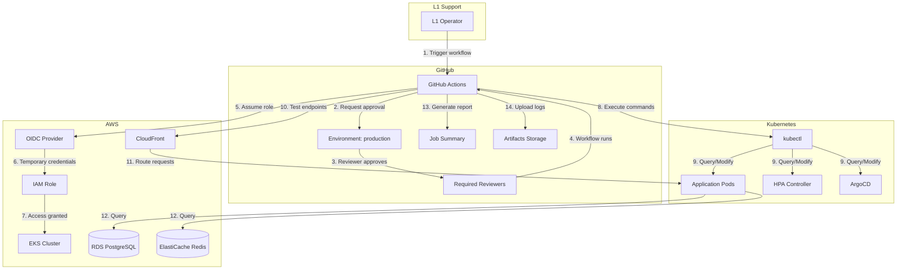
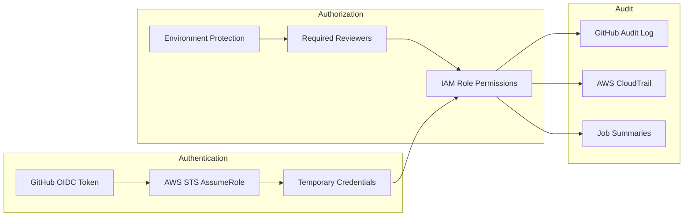
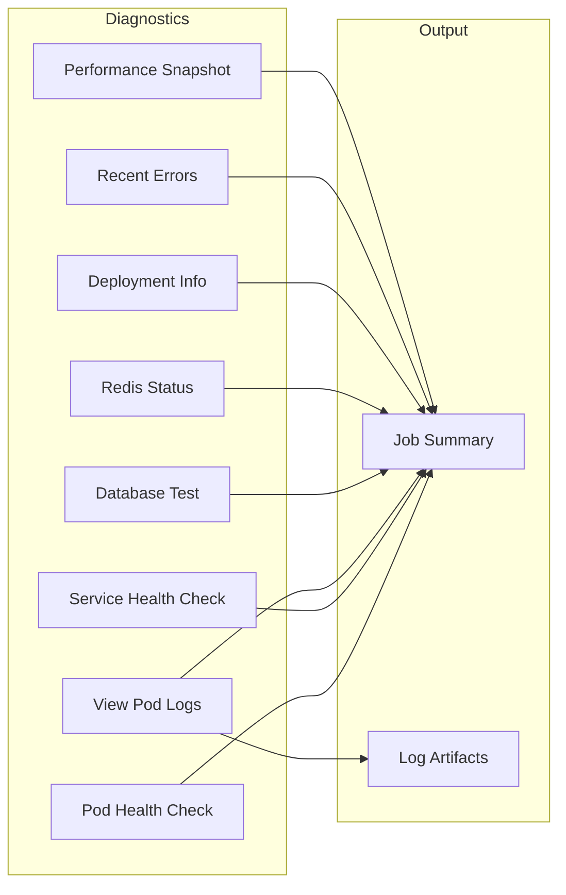
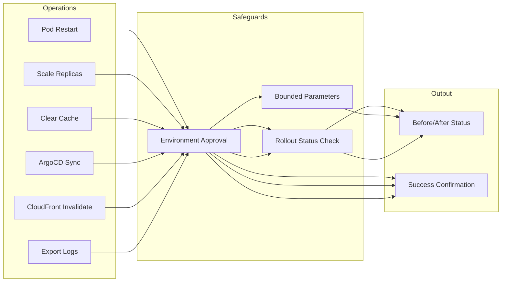
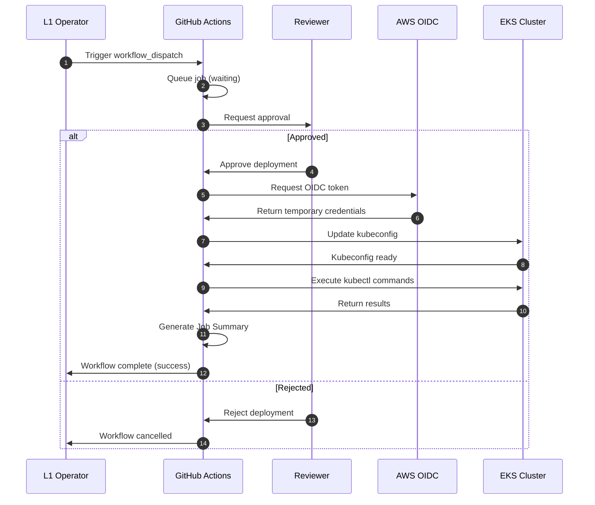
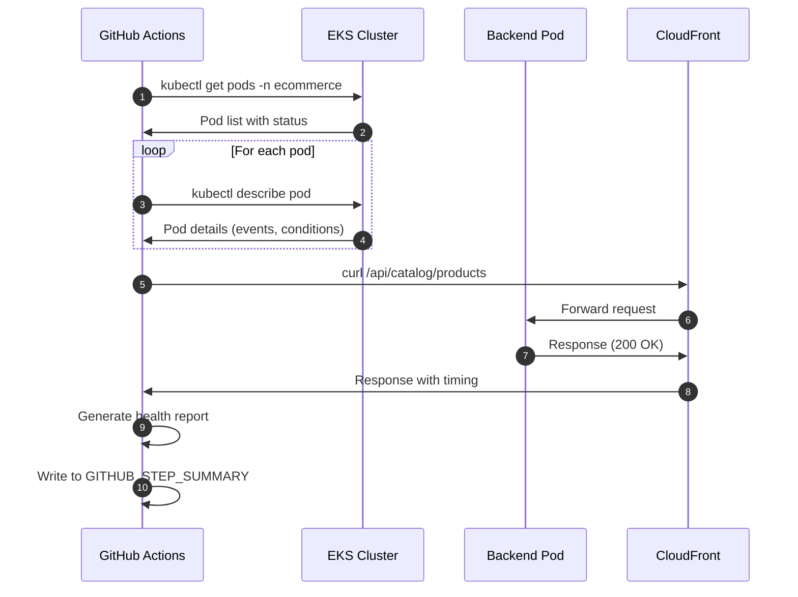
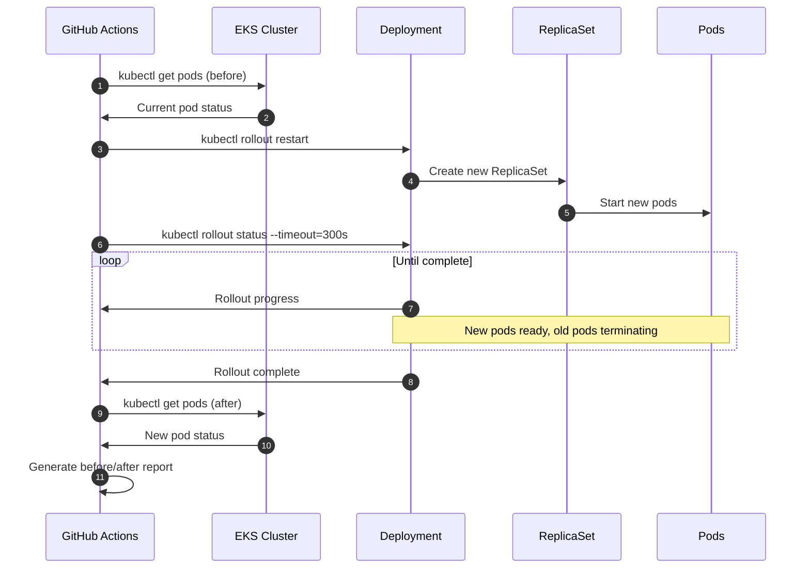
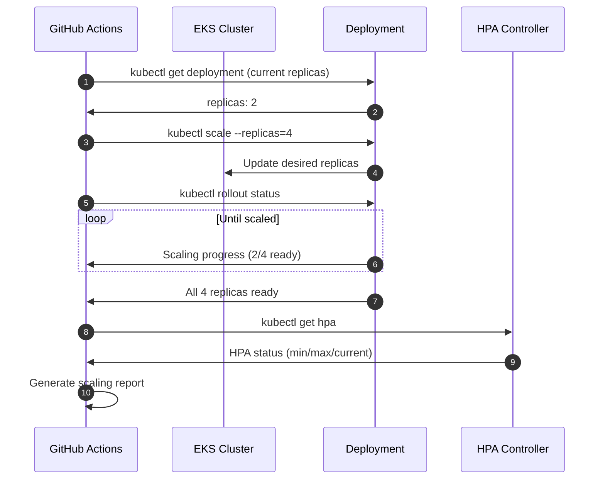
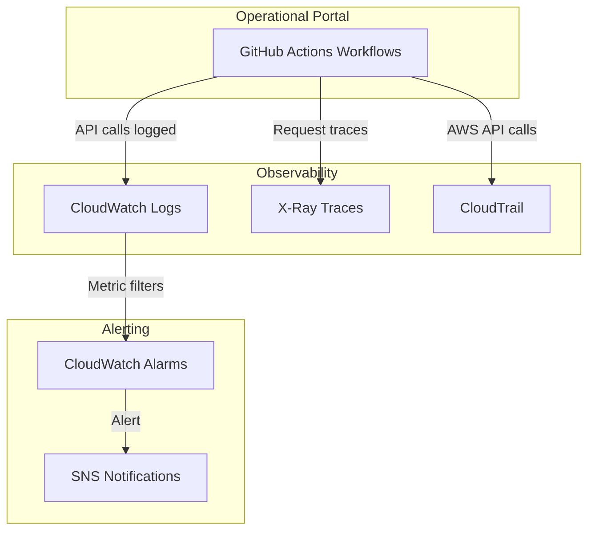

# Operational Portal Architecture

## Overview

The Operational Portal provides L1 Support teams with self-service capabilities through GitHub Actions workflows. All operations are non-destructive, require approval, and generate detailed audit trails.

## Architecture Diagram



## Security Model



## Workflow Categories

### Read-Only Operations



### Controlled Modifications



## Sequence Diagrams

### Workflow Execution Flow



### Pod Health Check Sequence



### Rolling Restart Sequence



### Scale Replicas Sequence



## Workflow Matrix

| Workflow | Type | kubectl | curl | Artifacts | Approval |
|----------|------|---------|------|-----------|----------|
| Pod Health Check | Read | `get pods`, `describe` | - | - | Required |
| Service Health Check | Read | `get pods` | endpoints | - | Required |
| View Pod Logs | Read | `logs` | - | - | Required |
| Database Test | Read | `exec` | - | - | Required |
| Redis Status | Read | `logs` | catalog API | - | Required |
| Deployment Info | Read | `get deploy,rs,hpa` | - | - | Required |
| Recent Errors | Read | `logs` | - | - | Required |
| Performance Snapshot | Read | `top nodes,pods` | API timing | - | Required |
| Export Logs | Read | `logs` | - | log files | Required |
| Pod Restart | Write | `rollout restart` | - | - | Required |
| Scale Replicas | Write | `scale` | - | - | Required |
| Clear Cache | Write | `rollout restart` | - | - | Required |
| ArgoCD Sync | Write | `patch application` | - | - | Required |
| CloudFront Invalidate | Write | - | - | - | Required |

## Parameter Constraints

All workflows use bounded parameters to prevent misuse:

```yaml
# Scale Replicas - bounded to 2-10
replicas:
  type: choice
  options: ['2', '3', '4', '5', '6', '7', '8', '9', '10']

# Log Lines - bounded options
lines:
  type: choice
  options: ['500', '1000', '2000', '5000']

# Application - predefined list
app:
  type: choice
  options: ['backend', 'frontend']

# Namespace - locked to ecommerce
namespace:
  type: choice
  options: ['ecommerce']
```

## Job Summary Examples

### Health Check Output

```markdown
## Pod Health Check

**Namespace:** `ecommerce`
**Timestamp:** 2026-01-03T13:00:00Z

### Pod Status
| Pod | Status | Restarts | Age |
|-----|--------|----------|-----|
| backend-abc123 | Running | 0 | 2d |
| backend-def456 | Running | 0 | 2d |

### Recent Events
No warning events found.

### API Health
| Endpoint | Status | Response Time |
|----------|--------|---------------|
| /api/catalog/products | 200 | 45ms |
```

### Scaling Output

```markdown
## Scale Replicas

**Application:** `backend`
**Target Replicas:** 4
**Namespace:** `ecommerce`

### Before Scaling
| Pod | Status |
|-----|--------|
| backend-abc123 | Running |
| backend-def456 | Running |

### Scaling to 4 replicas...
Waiting for scale to complete...

### After Scaling
| Pod | Status |
|-----|--------|
| backend-abc123 | Running |
| backend-def456 | Running |
| backend-ghi789 | Running |
| backend-jkl012 | Running |
```

## Error Handling

All workflows include error handling patterns:

```bash
# Graceful degradation
kubectl get pods 2>/dev/null || echo "Unable to fetch pods"

# Timeout protection
kubectl rollout status --timeout=300s

# Null checks
if [ -z "$POD" ]; then
  echo "### No pods found" >> $GITHUB_STEP_SUMMARY
  exit 1
fi
```

## Monitoring Integration



## Future Enhancements

1. **Slack Integration**: Post workflow results to ops channel
2. **Runbook Links**: Add documentation links in Job Summaries
3. **Scheduled Health Checks**: Automated daily health reports
4. **Cost Visibility**: Add AWS cost metrics to Performance Snapshot
5. **Incident Templates**: Pre-filled issue templates from error searches
