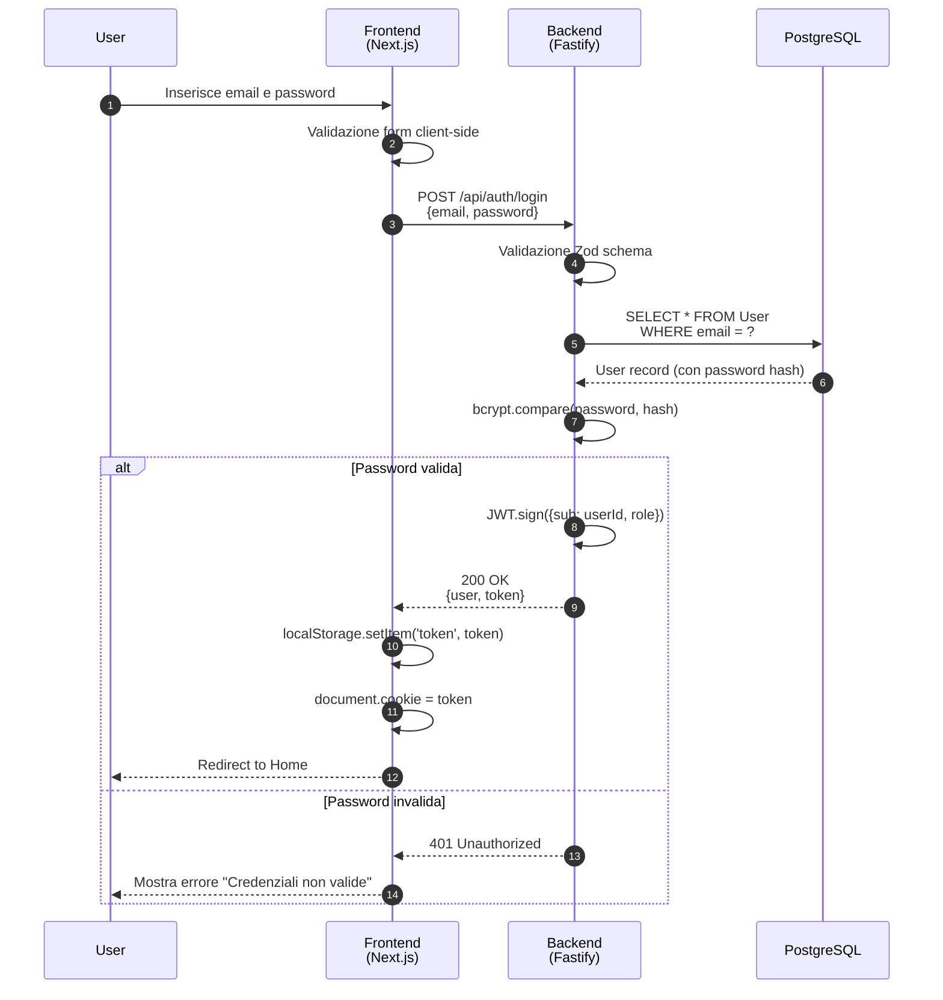
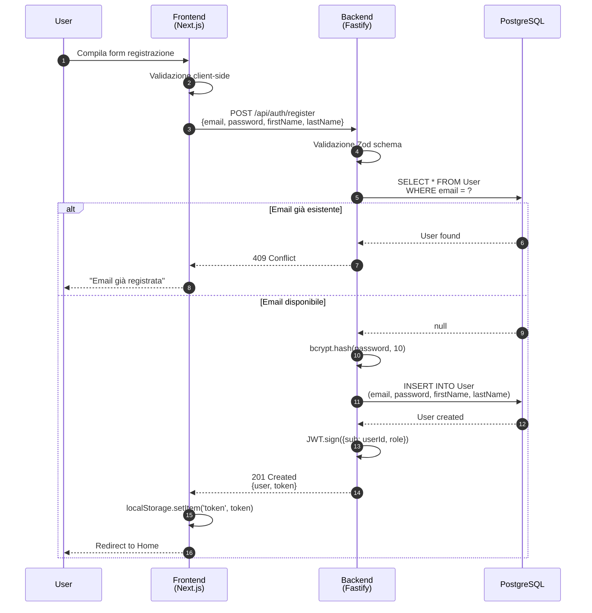
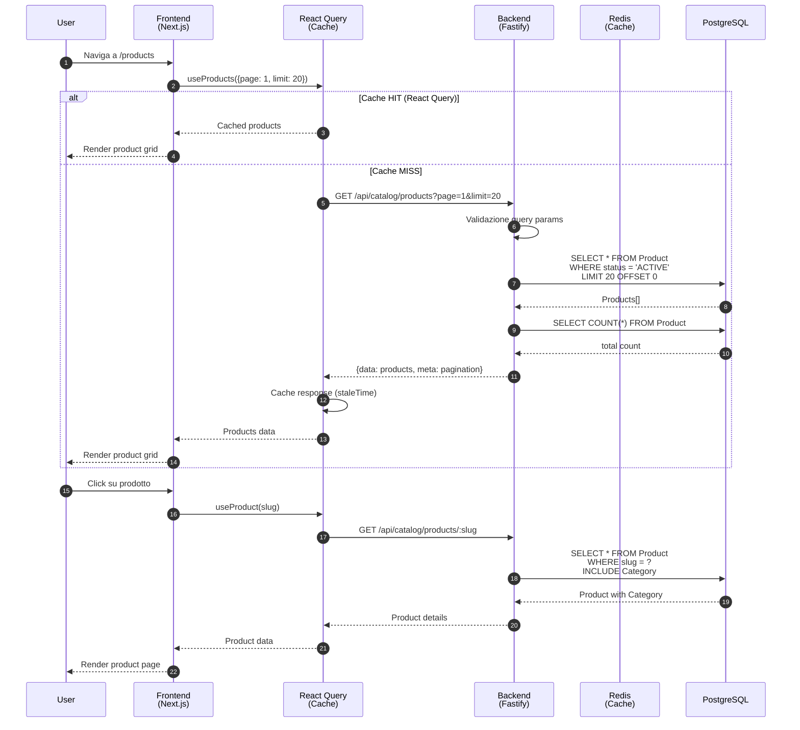
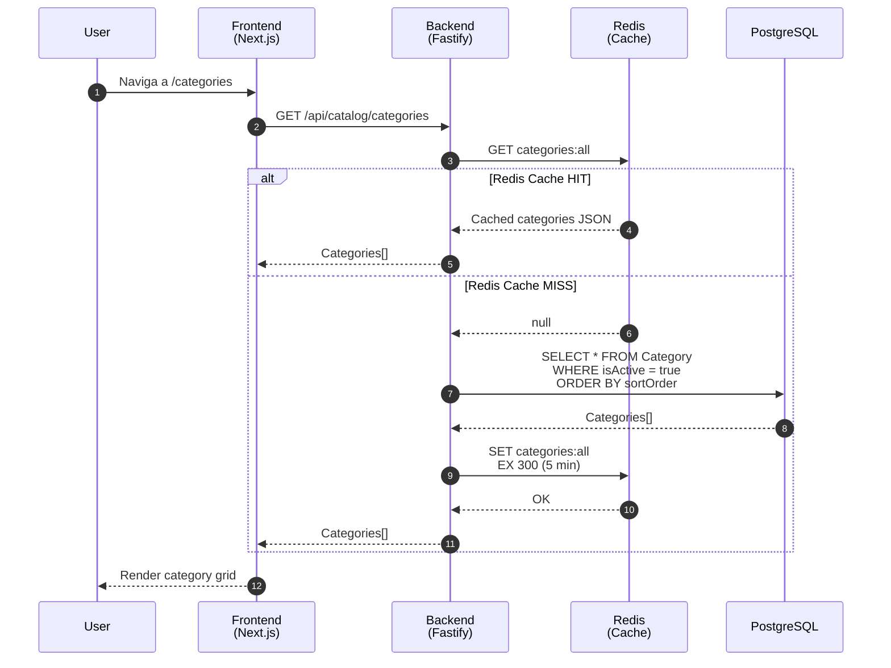
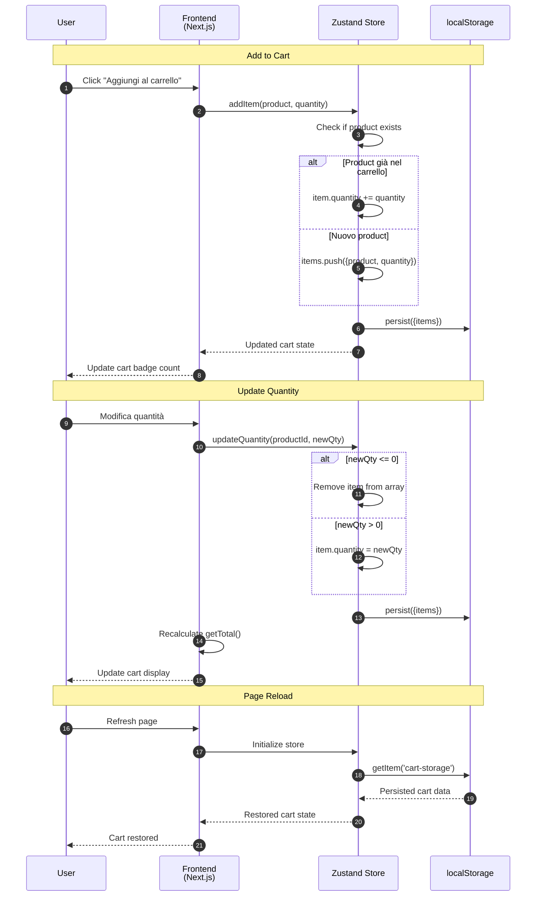
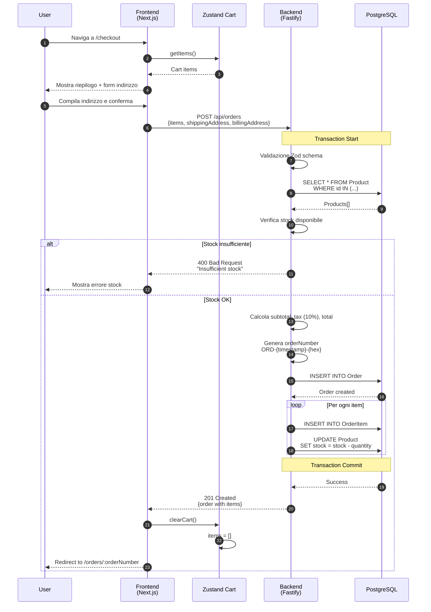
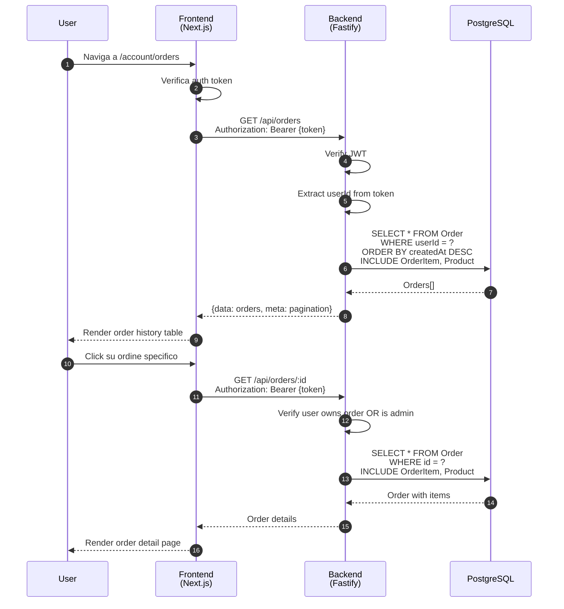
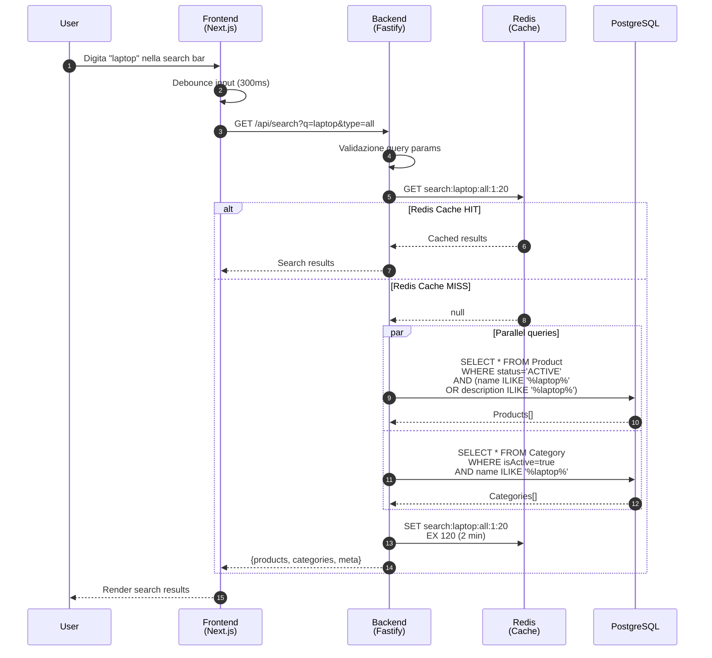
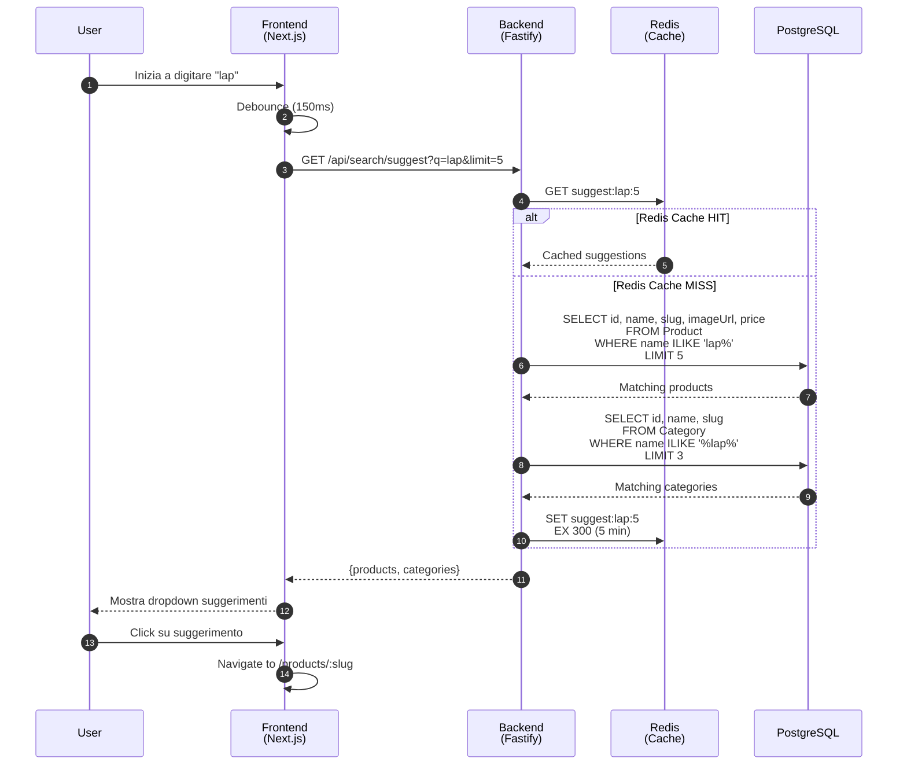
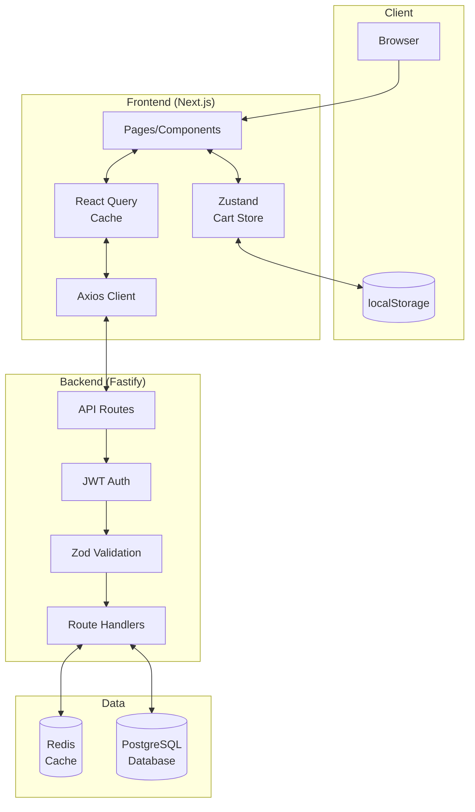

# Sequence Diagrams - E-commerce Demo

Diagrammi di sequenza per i principali flussi applicativi.

---

## 1. Autenticazione (Login)

---

## 2. Registrazione

---

## 3. Browse Prodotti (con Cache)

---

## 4. Browse Categorie (con Redis Cache)

---

## 5. Gestione Carrello (Client-Side)

---

## 6. Checkout e Creazione Ordine

---

## 7. Visualizzazione Ordini

---

## 8. Ricerca Prodotti (con Redis Cache)

---

## 9. Autocomplete/Suggerimenti

---

## 10. Architettura Generale

---

## Legenda

| Componente | Tecnologia | Funzione |
|------------|------------|----------|
| **Frontend** | Next.js 16 | UI, routing, state management |
| **React Query** | TanStack Query | Data fetching, client-side cache |
| **Zustand** | Zustand + persist | Cart state, localStorage sync |
| **Backend** | Fastify | REST API, business logic |
| **Redis** | Redis | Server-side cache (5-10 min TTL) |
| **PostgreSQL** | Prisma ORM | Persistent data storage |

---

## Cache Strategy

| Dato | Cache Layer | TTL |
|------|-------------|-----|
| Categories | Redis | 5 min |
| Products list | React Query | staleTime |
| Search results | Redis | 2 min |
| Suggestions | Redis | 5 min |
| Popular items | Redis | 10 min |
| Cart | localStorage | Persistent |
| Auth token | localStorage | Until logout |

---

*Documento generato: 2025-12-30*
